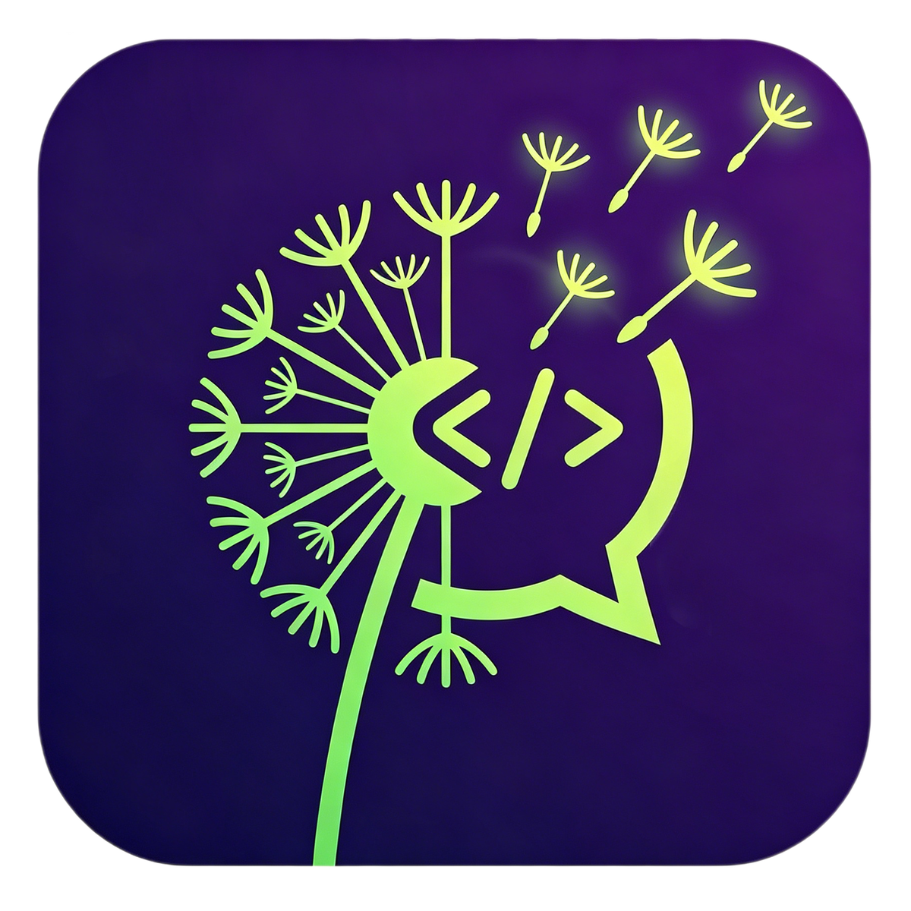

[English](./README.md) | [中文](./README.zh-CN.md)

<div align="center">
	
   <h3>Match the best agent technology in usability, say no to token markup, and enjoy the magic of AI programming at minimal token cost</h3>
</div>


## CoderChat

Like Void, CoderChat is an alternative to tools such as Cursor, Qoder, Trae, and CodeBuddy. It primarily addresses their limitations: inability to freely configure models, opaque pricing, and lack of support for data compliance in special scenarios.

CoderChat is developed from Void and serves as an upgraded version. This repository retains all features from Void while providing deep optimizations and continuous feature iteration.

Use AI agents on your codebase, checkpoint and visualize changes, and bring any model or host locally. CoderChat sends messages directly to providers without retaining your data.


## Download [releases](https://github.com/coderchatwang/CoderChat/releases/)


| Platform | Download Links (1.4.0) | Notes |
|----------|------------------------|-------|
| macOS (Apple Silicon) | [CoderChat-darwin-arm64.dmg](https://github.com/coderchatwang/CoderChat/releases/download/1.4.0/CoderChat-darwin-arm64.dmg) | Unsigned; if installation is blocked, you need to trust it before opening |
| macOS (Intel) | [CoderChat-darwin-x64.dmg](https://github.com/coderchatwang/CoderChat/releases/download/1.4.0/CoderChat-darwin-x64.dmg) | Unsigned; if installation is blocked, you need to trust it before opening |
| Windows (x64) | [CoderChatSetup-x64-user.exe](https://github.com/coderchatwang/CoderChat/releases/download/1.4.0/CoderChatSetup-x64-user.exe) <br> [CoderChatSetup-x64-system.exe](https://github.com/coderchatwang/CoderChat/releases/download/1.4.0/CoderChatSetup-x64-system.exe) | Unsigned; if blocked, it is a system default behavior |
| Windows (ARM64) | [CoderChatSetup-arm64-user.exe](https://github.com/coderchatwang/CoderChat/releases/download/1.4.0/CoderChatSetup-arm64-user.exe) <br> [CoderChatSetup-arm64-system.exe](https://github.com/coderchatwang/CoderChat/releases/download/1.4.0/CoderChatSetup-arm64-system.exe)  | Unsigned; if blocked, it is a system default behavior |

**Note:** Due to the need for long-term payment of certificate fees, the developer is currently unable to resolve the installer signing issue. Please handle the trust issue yourself. The developer only guarantees that the installers in this repository are safe, reliable, and virus-free. Do not download or install this software from any links outside this repository.


## Preview

<div align="center">
	
</div>

## Cost Overview

| Recommended Access Method | Pricing Model | Remarks | Monthly Cost Estimate (CNY) | Monthly Cost Estimate (USD*) |
| :--- | :--- | :--- | :--- | :--- |
| **Coding Plan (JD, GLM, etc.)** | Fixed monthly fee | ¥40/month, includes 18,000 API calls, generally more than enough | **¥40** | **≈ $5.56** |
| **DeepSeek V4 Pro, etc.** | Pay per token | Pay as you go, no charge when not in use. See official website for details | **≥0** | **≥$0** |
| **Local Model** | None | Not recommended, may produce poor results | **0** | **$0** |
| **API Relay (accessible but not recommended)** | Unknown | **Unreliable API relays may pose a man‑in‑the‑middle attack risk – not caused by this software!!** | **≥0** | **≥$0** |

> *Note: This software is free. Costs shown are official prices from compute providers. USD estimates are based on approximate exchange rates; please refer to real‑time rates.*

## CoderChat and Void are both based on VS Code. Why not just use Void or VS Code directly?
Unfortunately, the Void project has been discontinued. Based on Void and VS Code, we have made a significant number of updates and will continue to optimize and improve.

| Feature | CoderChat | Void |
|---------|-----------|------|
| Skill Support | ✔️ | ❌ |
| Stable MCP Support | ✔️ | ❌ |
| Session Export/Import Sharing | ✔️ | ❌ |
| Proper light theme support | ✔️ | ❌ |
| Display creation time for chat messages | ✔️ | ❌ |
| Support for deleting individual items from recent projects/file list | ✔️ | ❌ |
| Global proxy configuration for chat (Anthropic, Google SDK) | ✔️ | ❌ |
| Compatibility with Anthropic-style system messages | ✔️ | ❌ |
| Exit confirmation prompt on Windows platform | ✔️ | ❌ |
| Internationalized Chinese support in chat | ✔️ | ❌ |
| Real-time cross-window session data synchronization | ✔️ | ❌ |
| Native Anthropic SDK call support | ✔️ | ❌ |
| Markdown caching (improved rendering performance) | ✔️ | ❌ |
| Language selection for AI replies in new user onboarding | ✔️ | ❌ |
| Support for AGENTS.md configuration file | ✔️ | ❌ |
| Filter conversation threads by project | ✔️ | ❌ |
| Quick confirmation for Gather mode execution | ✔️ | ❌ |
| Enhanced Gather mode prompts | ✔️ | ❌ |
| Dependency updates aligned with the latest VS Code version, delivering a performance leap | ✔️ | ❌ |
| More professional system prompts | ✔️ | ❌ |
| Paginated loading of historical messages | ✔️ | ❌ |
| Vision model support | ✔️ | ❌ |
| ask_user_question tool support | ✔️ | ❌ |
| xml_escape tool support | ✔️ | ❌ |
| Pre-configured 10 general API providers | ✔️ | ❌ |
| showJsonDebug toggle (for debugging JSON display) | ✔️ | ❌ |
| Display role and model information | ✔️ | ❌ |
| Display retry errors and optimized retry logic in UI | ✔️ | ❌ |
| Show source URL for OpenAI Compatible | ✔️ | ❌ |
| ... |  |  |
| Ongoing bug fixing capabilities | ✔️ | ❌ |
| Continuous feature updates and support | ✔️ | ❌ |
## Usage & Configuration

> **Important**: The values of `contextWindow` and `reservedOutputTokenSpace` must be configured according to the specific model you are using. Additionally, `specialToolFormat` must be set correctly; otherwise, unexpected issues may occur. Supported values for `specialToolFormat` are `'openai-style'`, `'anthropic-style'`, and `'gemini-style'`. If left empty, it defaults to `'openai-style'`.

<div align="center">
	
</div>

Below is the configuration reference for the GLM-5 model:

```json
{
  "contextWindow": 128000,
  "reservedOutputTokenSpace": 4096,
  "supportsSystemMessage": "system-role",
  "specialToolFormat": "openai-style",
  "supportsVision": false,
  "reasoningCapabilities": {
    "supportsReasoning": true,
    "canTurnOffReasoning": false,
    "canIOReasoning": false,
    "openSourceThinkTags": ["<think>", "</think>"]
  }
}
```

> **Note**: Enabling `supportsVision` enables image input support. Only enable this if the model actually supports vision capabilities.

Example configuration for a vision-capable model (e.g., Kimi-K2.5):

```json
{
  "contextWindow": 128000,
  "reservedOutputTokenSpace": 4096,
  "supportsSystemMessage": "system-role",
  "specialToolFormat": "openai-style",
  "supportsVision": true,
  "reasoningCapabilities": {
    "supportsReasoning": true,
    "canTurnOffReasoning": false,
    "canIOReasoning": false,
    "openSourceThinkTags": ["<think>", "</think>"]
  }
}
```

## Important Notes

- Over 95% of the code in this project was developed by CoderChat + GLM5 (JD.com codingplan). To add, GLM5 completely exceeded expectations during development. When using CoderChat, you don't need to blindly believe in so-called Anthropic models. Technology has no borders, but given Anthropic's hostility toward developers from China, this project did not use any Anthropic models in its development.
- Development configuration for this project can be customized using CoderChat itself. Therefore, the author will not provide separate usage documentation.
- For documentation related to Void, please refer to the official Void project documentation.
- Although CoderChat supports local models and arbitrary model configuration via APIs, tests have shown that models without strong agent coding capabilities cannot reliably deliver production-grade results. For recommended models, refer to the coding plan supported model lists from mainstream providers. The primary model used in the development of this project is GLM-5.

## Reference

- CoderChat is a fork of [Void](https://github.com/voideditor/void/tree/main).
- Void is a fork of the [vscode](https://github.com/microsoft/vscode) repository.
- [iFlow CLI](https://github.com/iflow-ai/iflow-cli) is a comprehensive command-line intelligence that embeds in your terminal

## License

This project is licensed under the **Apache License 2.0**. See the [LICENSE](LICENSE) file for details.
