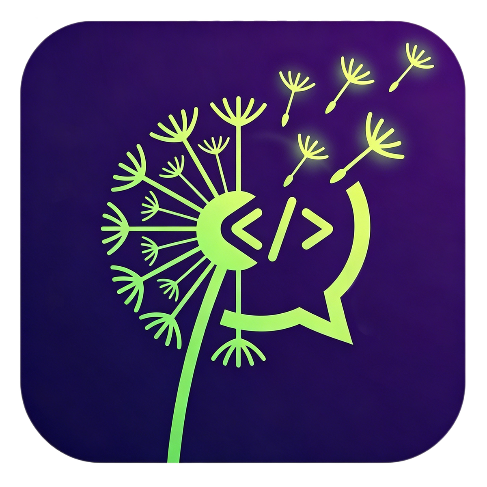
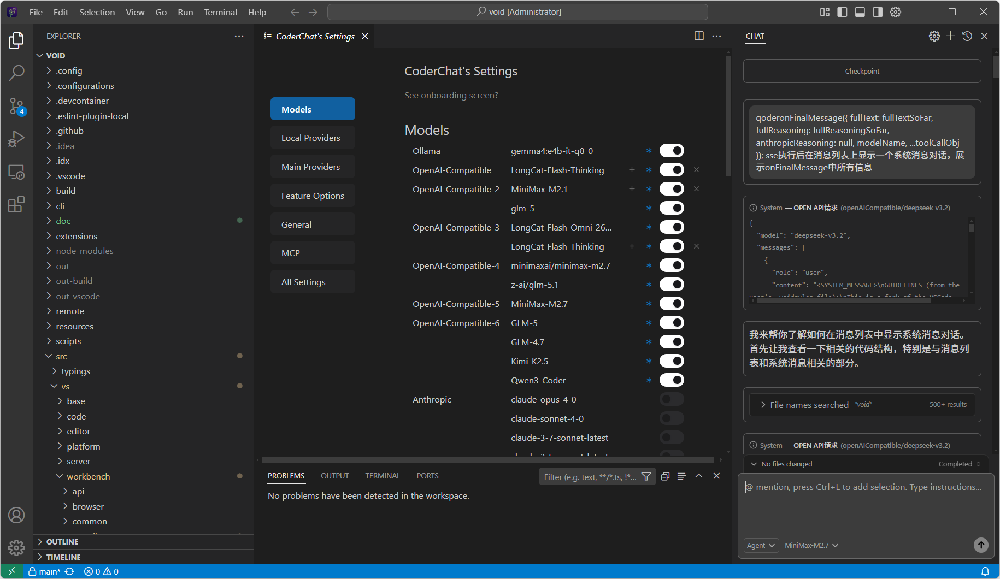

[English](./README.md) | [中文](./README.zh-CN.md)

<div align="center">
	
</div>

## CoderChat

与 Void 类似，CoderChat 是 Cursor、Qoder、Trae、CodeBuddy 等工具的一个替代方案。它主要解决了这些工具的不足：无法自由配置模型、定价不透明、以及在特殊场景下缺乏对数据合规性的支持。

CoderChat 基于 Void 开发，是一个增强版本。本仓库保留了 Void 的所有功能，并提供了深度优化和持续的功能迭代。

在你的代码库上使用 AI 智能体，检查点并可视化变更，并将任何模型或主机带到本地。CoderChat 直接向服务提供商发送消息，不会保留你的数据。

## 预览

<div align="center">
	
</div>

## 使用方法与配置

> **重要**：`contextWindow` 和 `reservedOutputTokenSpace` 的值必须根据你所使用的具体模型进行配置。此外，`specialToolFormat` 必须正确设置，否则可能会出现意外问题。`specialToolFormat` 支持的值包括 `'openai-style'`、`'anthropic-style'` 和 `'gemini-style'`。如果留空，默认为 `'openai-style'`。

以下是 GLM-5 模型的配置参考：

```json
{
  "contextWindow": 128000,
  "reservedOutputTokenSpace": 4096,
  "supportsSystemMessage": "system-role",
  "specialToolFormat": "openai-style",
  "supportsVision": false,
  "reasoningCapabilities": {
    "supportsReasoning": true,
    "canTurnOffReasoning": false,
    "canIOReasoning": false,
    "openSourceThinkTags": ["<think>", "</think>"]
  }
}
```

> **注意**：启用 `supportsVision` 将开启图像输入支持。仅当模型确实具备视觉能力时才启用此选项。

支持视觉能力的模型配置示例（例如 Kimi-K2.5）：

```json
{
  "contextWindow": 128000,
  "reservedOutputTokenSpace": 4096,
  "supportsSystemMessage": "system-role",
  "specialToolFormat": "openai-style",
  "supportsVision": true,
  "reasoningCapabilities": {
    "supportsReasoning": true,
    "canTurnOffReasoning": false,
    "canIOReasoning": false,
    "openSourceThinkTags": ["<think>", "</think>"]
  }
}
```

## 重要说明

- 本项目超过 95% 的代码由 **CoderChat + GLM5 + MiniMax-M2.7** 开发完成。
- 本项目的开发配置可以使用 CoderChat 自身进行定制。因此，作者不会单独提供使用文档。
- 有关 Void 的文档，请参考 Void 官方项目文档。
- 尽管 CoderChat 支持本地模型以及通过 API 进行任意模型配置，但测试表明，不具备强大智能体编码能力的模型无法可靠地交付生产级结果。推荐的模型请参考主流提供商提供的编码计划支持模型列表。本项目开发过程中使用的主要模型是 GLM-5。

## 参考

- CoderChat 是 [Void](https://github.com/voideditor/void/tree/main) 的一个分支。
- Void 是 [vscode](https://github.com/microsoft/vscode) 仓库的一个分支。

## 许可证

本项目采用 **Apache License 2.0** 许可证。详情请参阅 [LICENSE](LICENSE) 文件。
